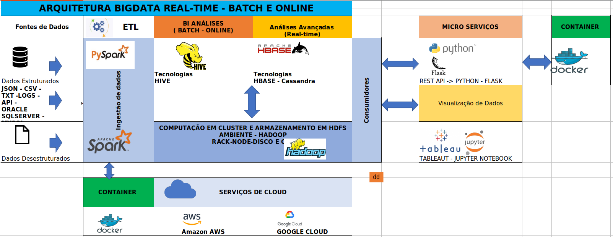
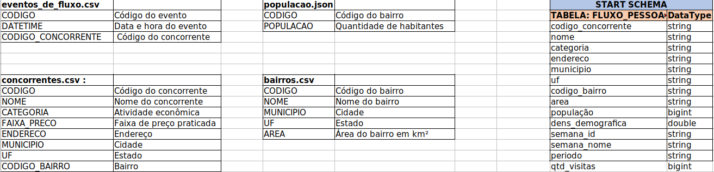
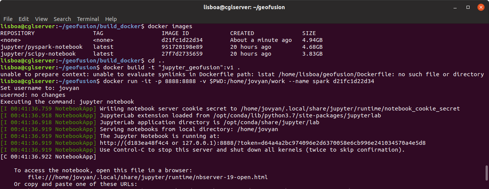

# GEOFUSION  Desafio Técnico 

##  Arquitetura BIGDATA Tecnologias 

 - APACHE SPARK
 - ETL - Projeto PYSPARK  
 - ETL - JUPYTER NOTEBOOK
 - DOCKER 
 - HIVE
 - MICROSERVIÇOS REST API
 
 
## Engenheiro de Dados 

### FEV/2019 - CGLSOFTCLAUDIO FEV/2019

[](https://github.com/cglsoft)


O objetivo da equipe GeoFusion é apresentar a solução de arquitetura de serviços escaláveis e otimizados em 
BigData para os clientes do setor de alimentação (restaurantes, pizzarias, bares, etc.).

Esta arquitetura poderá estar hospedadas nos serviços de nuvens dos fornecedores:
 - AWS Amazon 
 - Google Cloud
 
 
Com base no porte do cliente, poderão ser ofertados dois modelos de processamentos:

  - Batch - Online com NoSQL HIVE para atender estas demandas
  - Real-time com NoSQL para grandes volumes de dados com o HBASE/Cassandra

Para o processamento (ETL), serão utilizados as tecnologias opensource Apache Spark PYSPARK rodando
em cluster no Ambiente HADOOP.

Todo o processo de deploy e distribuição das soluções irão utilizar container LINUX/Docker nos serviços de 
nuvens acima citados.

A equipe comercial poderá oferecer esta arquitetura nos cenários :
 - Real-time, 
 - batch e Online. 

O Datalake com as informações dos clientes poderão ser consumidas via Micro Serviços, e ou
diretamente com as ferramentas de visualização de dados como Tableaut, Jupyter Notebook.
 

Esta solução irá entregar Micro Serviços REST API com a utilização das tecnologias Python 
com Flask, onde os parceiros poderão consumir os serviços conforme os planos contratados.

## Implantação da solução

### Modelagem Star schema para gravacao no Datalake

[](https://github.com/cglsoft)

 ### Repositório GIT

Acessar o diretório de projetos e clonar o repositório do [GIT GEOFUSION DESAFIO](https://github.com/cglsoft/) na pasta gf_desafio.

Passos para instalação:

```sh
$ git clone git clone https://github.com/cglsoft/gf_desafio.git
$ cd gf_desafio
```

### Deploy DOCKER Container PYSPARK/JUPYTERNOTEBOOK

Para rodar a solução o primeiro passo será fazer build do container Docker localizado na pasta gf_desafio/build_docker.

Acessar o diretório build_docker para e executar o script abaixo para a criação da imagem:

```sh
$ cd build_docker
$ docker build -t jupyter_geofusion:v1 .
```

#####Referências: Container Docker HUB o repositório do [HUB](https://hub.docker.com/).

Após a criação do container, executar o comando abaixo para identificar o IMAGE_ID que será a referência para a execução do container.

```sh
$ docker images
```


De posse do IMAGE_ID da imagem criada, executar os comandos abaixo subir o container e validação da solução:

####Atenção: Voltar para o diretório do projeto!


```sh
$ cd ..
$ docker run -it -p 8888:8888 -v $PWD:/home/jovyan/work --name spark 2bd4d02727b8 
```

Apos o deploy do serviço será fornecido o TOKEN que deverá ser copiado conforme tela abaixo:

[](http://127.0.0.1:8888)


No navegador de sua preferência, acessar o endereço do Jupyter Notebook: [Jupyter Notebook](http://127.0.0.1:8888).

```sh
127.0.0.1:8888
```

# Projeto ETL - SPARK-SUBMIT  

O projeto disponibilizado faz toda a funcionalidade do JUPYTER NOTEBOOK conforme demonstrado acima, agora com o plus de execução em cluster.

Na pasta [] é possível explorar todo o código ETL para carga das informações:

Veja [ETL Carga Datalake](https://github.com/cglsoft/gf_desafio/tree/master/etl_pyspark)


# Projeto MICROSERVICES - REST API.

Para consumir o serviço desta API acessar o diretório app_rest e seguir os procedimentos abaixo:


```sh
cd app_rest
$ docker build -t microservico_rest:latest .
```

Executando o container da imagem criada:


```sh
$ docker run -d -p 5000:5000 microservico_rest:latest
```


Com o serviço em execução acessar o browser e abrir o endereço abaixo:

ou utilizar o curl para testar:


```sh
$ curl http://127.0.0.1:5000/concorrentes/1428478957431771
```


# Analise de Dados

As análises estão disponíveis na planilha do EXCEL:

Veja [Análises de dados](https://github.com/cglsoft/gf_desafio/blob/master/AnalisePotencial.xlsx)


FIM